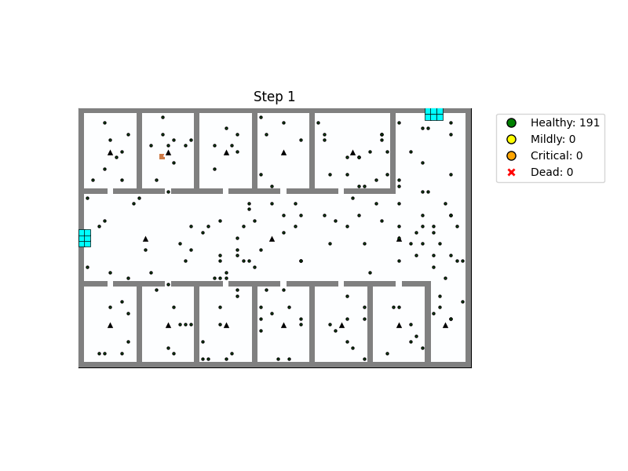

# Adaptive Evacuation Strategies for House Fires Modeled by Cellular Automata

## Overview
This project simulates building fire evacuations using a grid-based cellular automaton. It models fire spread, smoke diffusion, evacuee agents with A* pathfinding and panic behaviors, and includes evacuation aids like light strips and fire alarms. The simulation can be run across multiple scenarios and densities, generating animations and evaluation metrics for analysis.



## Features
- **Fire Spread Model:** Ignition, burn duration, and probabilistic spreading of fire across adjacent cells.
-  **Smoke Diffusion Model:** Continuous emission of smoke from burning cells and diffusion through open spaces.
- **Evacuee Agents:** A* pathfinding with smoke and fire avoidance, collision blocking, health-based speed changes, and panic responses to hazards.
- **Evacuation Aids:** Light strips that indicate safe exits and dynamic fire alarms with hearing radius that trigger panic.
- **Visualization:** Static frame display and inline animations using Matplotlib, with color-coded layers and agent health statuses.
- **Configurable Experiments:** Run multiple seeds, evacuee densities (`small`, `medium`, `large`), and scenarios (`no aids`, `lightstrips`, `firealarms`, `combined`).
- **Evaluation Metrics**: Tracks completion time, death rate, and time series of survival counts.
- **Result Handling**: Scripts to aggregate CSV outputs and plot survival curves for comparative analysis.

## Installation
### Requirements
- NumPy
- Pandas
- Matplotlib
- Pillow
- tqdm
- IPython (for Jupyter display support)

## Project Structure

```
src/
├── agentEvacuee.py        # EvacueeAgent class: movement, health, panic logic
├── aids.py                # LightStripLayer and FireAlarmLayer implementations
├── baseClasses.py         # Abstract BaseLayer for all CA layers
├── fireSimulation.py      # FireLayer and SmokeLayer models
├── mapLoading.py          # Load maps from images or text files
├── structures.py          # StructureLayer and Environment orchestration
├── EvaluationMetrics.py   # Evacuation metrics collection
├── config/
│   └── FireAlarm_config.py # Predefined fire alarm placements and radii
├── main_experiment_loop.py # Main script to run batch simulations
└── result_handling.py     # CSV loading and plotting utilities

maps/                       # Floor plan images (PNG)
csv-outputs/                # Generated CSV summary files
simulation-gifs/            # Output GIF animations organized by map
```
## Usage

### Running Experiments

Execute the main loop to run experiments across scenarios and densities:

```python
python main_experiment_loop.py
```
* Edit the `filepath`, `config`, `evacuee_densities`, and `scenarios` variables at the top of `main_experiment_loop.py` to select the floor plan, fire alarm configuration, density levels, and simulation scenarios:
    ```python
    # Selected map
    filepath = 'maps/baseline_1.png' # look in the maps directory for the possible maps

    # Config for selected map
    config = get_firealarm_config('baseline', 'main') # look into FireAlarm_config.py in the src/config directory for the possible configurations

    # Evacuee population density levels
    evacuee_densities = ["small", "medium", "large"]

    # Simulation scenarios to run
    scenarios = ["no aids", "lightstrips", "firealarms", "combined"]
    ```

* Results:

  * **Animations** saved under `simulation-gifs/<map_name>/` as GIF files.
  * **CSV summary** saved to `csv-outputs/<map_name>_results.csv`.


To run a single experiment run:
```python
python main_single_experiment.py
```
### Custom Maps

Add new floor plan images to the `maps/` directory. Ensure color mapping:

* Walls: `128,128,128`
* Empty floor: `244,255,255`
* Doors/exits: `0,0,0`
* (Optional) Initial fire: `255,0,0`sure color mapping:

* Walls: `128,128,128`
* Empty floor: `244,255,255`
* Doors/exits: `0,0,0`
* (Optional) Initial fire: `255,0,0`


